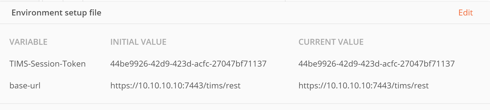
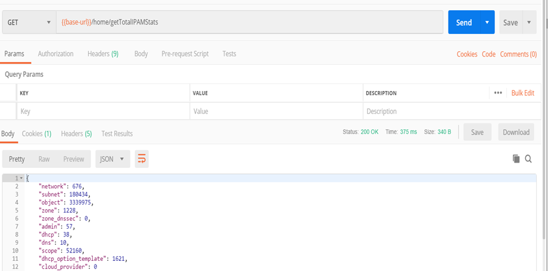
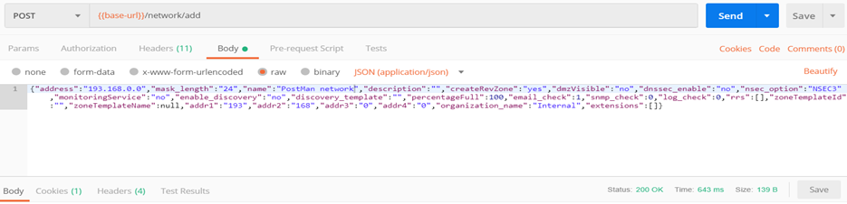

# TCPWave-Postman-Integration
### TCPWave uses Postman tool for RestAPI Automation testing
TCPWave uses the Postman tool over other RESTful API testing tools because of the following:

• Accessibility - To use Postman, you are required to log-in to the respective accounts making it easy to access files anytime, anywhere if a Postman application is installed on the computer.

•	Use of Collections - Postman lets users create collections for their API calls. Each collection can create subfolders and multiple requests. This helps in organizing your test suites.

•	Collaboration - Collections and environments can be imported or exported making it easy to share files. A direct link can also be used to share collections.

•	Creating Environments - Having multiple environments aids in less repetition of tests as one can use the same collection but for a different environment

•	Creation of Tests - Test checkpoints such as verifying for successful HTTP response status can be added to each API call which helps ensure test coverage.

•	Automation Testing - Using the Collection Runner or Newman, tests can be run in multiple iterations saving time for repetitive tests.

•	Debugging - Postman console helps to check what data has been retrieved making it easy to debug tests.

•	Continuous Integration - With its ability to support continuous integration, development practices are maintained.

### Working with Postman collection files
1. Import JSON environment file. You can declare global variables in that file.

2. The imported global variables are as shown:
   

3. TCPWave uses Token-Based Authentication to execute the rest calls from postman.

4. For token-based authentication, you need to create the session token in the TCPWave IPAM and copy-paste the value in the environment file token field value.

5.For another Global variable base-URL you are required to provide the address of the system. The address of the system belongs to the system on which execution is done. (URL: https://10.10.10.10:7891/tims/rest)

### Sample Get Call  
 
 
 
### Sample Post Call  
 
